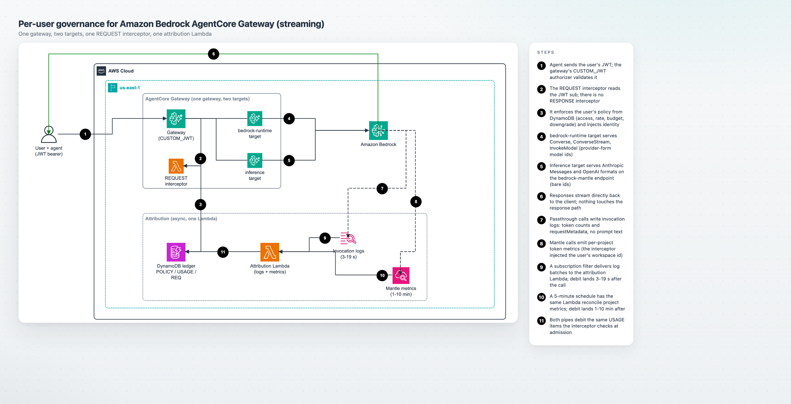

# Per-user governance for Amazon Bedrock AgentCore Gateway

Amazon Bedrock AgentCore Gateway supports REQUEST interceptors: a Lambda the
gateway invokes before it forwards a request, with the caller's validated JWT
claims available to it. This sample uses that extension point to govern model
access per end user.

It deploys one interceptor and a DynamoDB table holding one policy item per
user, then applies per-user attribution, token budgets, model allowlists,
automatic model downgrade, and request rate limits, with streaming responses
preserved. A team running one gateway for many people can account for model
usage per person and set a budget for each.

It is for platform teams that run a shared gateway for many users within their
organization. Agents keep using their existing SDKs (Strands, LangGraph, Claude
Code, the Anthropic and OpenAI SDKs, or plain boto3); the only change is the
gateway base URL and the end user's token.

> This is sample code for non-production use. Work with your security and legal
> teams to meet your own security, regulatory, and compliance requirements before
> deploying it. See [Security and responsible AI](#security-and-responsible-ai).

## Controls

Policy is one DynamoDB item per user. Changes to the item take effect on the next
request, with no redeployment. The interceptor evaluates five controls before the
model runs:

| Control | Response |
|---|---|
| User is blocked | `403 access_denied` |
| Model is outside the user's allowlist | `403 model_not_allowed` |
| Burst past the per-minute cap | `429 rate_limit_exceeded` |
| Usage past the token budget | `429 budget_exceeded` with a `retry_after` hint |
| Usage past the downgrade threshold | Request rewritten to the user's fallback model |

Enforcement lags settlement by one turn. Attribution runs asynchronously and does
not block the response path, so responses stream. A turn that crosses a limit
completes; the next turn is warned, downgraded, or refused. Account for this lag
when setting budget values.

## Architecture



One AgentCore gateway with a `CUSTOM_JWT` authorizer against Cognito carries two
targets behind a single authorizer, a single interceptor, and a single ledger.
Each target is referred to as a door. The door a request arrives through
determines the model id form it accepts and how its usage is counted.

| Door | Target | Serves |
|---|---|---|
| `/inference` | `bedrock-mantle` inference connector | Anthropic Messages at `/v1/messages`, OpenAI at `/v1/chat/completions` and `/v1/responses` |
| `/bedrock-runtime` | HTTP passthrough to Amazon Bedrock | `/model/{id}/converse`, `/converse-stream`, `/invoke`, `/invoke-with-response-stream` |

`bedrock-mantle` is a second Amazon Bedrock endpoint that serves the OpenAI and
Anthropic wire formats. It accepts requests from unmodified Anthropic and OpenAI
SDKs. See
[Endpoints supported by Amazon Bedrock](https://docs.aws.amazon.com/bedrock/latest/userguide/endpoints.html).

Both doors share one REQUEST-only interceptor. The stack does not attach a
RESPONSE interceptor: a RESPONSE interceptor causes the gateway to buffer the
complete reply, which ends streaming.

Usage reaches the ledger from two sources with different lag. Passthrough calls
are debited from Bedrock model invocation logs within seconds, carrying token
counts only and no prompt or response bodies. Inference-connector calls are
debited from `AWS/BedrockMantle` per-project metrics on a five-minute schedule.
Both land on the same per-user aggregate. Settlement is exactly-once through a
conditional DynamoDB transaction, so a redelivered log batch does not debit
twice. [`infra/README.md`](infra/README.md) documents the settlement mechanism.

Model ids are matched verbatim against the allowlist, and the two doors take
different forms. `/inference` takes bare ids such as
`anthropic.claude-haiku-4-5`. `/bedrock-runtime` takes inference-profile ids such
as `us.anthropic.claude-haiku-4-5-20251001-v1:0`. Include every id form your
clients send.

## Prerequisites

- An AWS account with Amazon Bedrock model access enabled for the models you
  intend to allow.
- A region where AgentCore Gateway, the `bedrock-mantle` endpoint, and your
  chosen models are all available. The `/inference` door and its per-project
  attribution both require `bedrock-mantle`; where it is unavailable, deploy only
  the `/bedrock-runtime` door. Verify regional availability before selecting a
  region other than `us-east-1`.
- AWS CLI v2 configured with credentials for that account.
- Node.js 20 or later, and npm.
- Python 3, used by the deploy scripts to read CloudFormation outputs and to
  create the first user's `bedrock-mantle` project. The project step requires
  `boto3` importable by that interpreter, to sign a SigV4 request to the
  `bedrock-mantle` project endpoint. Every other step uses the standard library
  only.
  Without `boto3`, the deploy script warns and continues, and the policy item is
  created with no `workspace_id`, which attributes `/inference` usage to the
  account's default project rather than to the user.
- Docker with buildx, for the optional demo web app only.

## Deploy the gateway

```bash
./deploy.sh --infra-only
```

This deploys the governance engine: the gateway with both doors, the interceptor,
the attribution pipeline, the DynamoDB ledger, and a Cognito user pool. It
creates a first user with a generated one-time password printed once, seeds that
user's policy item, and prints a smoke-test command.

`infra/scripts/deploy.sh` runs the same steps directly. See
[`infra/README.md`](infra/README.md) for the step-by-step breakdown and every
construct option.

### Bedrock invocation logging

Attribution on the `/bedrock-runtime` door reads Bedrock model invocation logs,
which are an account-level setting. If your account already has invocation
logging configured, the deploy script asks whether to reuse the existing log
group or overwrite the configuration. Reuse is the default: it leaves the
existing configuration and its consumers unchanged, and the stack attaches only
its own subscription filter. With no existing configuration, the script enables
logging with every data-delivery flag off, so metadata is recorded and prompt and
response content is not. Pass `--reuse-logging` or `--force-logging` to skip the
prompt in CI.

## Point your agent at it

The gateway governs any client that can send a bearer token. For the Anthropic
SDK, change the base URL and supply the token:

```python
import anthropic

# auth_token sends Authorization: Bearer <JWT>, which the gateway requires.
client = anthropic.Anthropic(auth_token=JWT, base_url=GATEWAY_URL + "/inference")

message = client.messages.create(
    model="anthropic.claude-haiku-4-5",
    max_tokens=128,
    messages=[{"role": "user", "content": "Say hello in five words."}],
)
```

[`recipes/`](recipes/README.md) has runnable equivalents for Strands, LangGraph,
Claude Code, the OpenAI SDK, and boto3, each annotated with the lines that move
an existing client onto the governed gateway. It also documents the policy item
fields and token expiry and refresh for long-running agents.

## Teardown

Gateway only:

```bash
infra/scripts/destroy.sh --region us-east-1
```

The script confirms the stack name, runs `cdk destroy`, and offers to disable the
account-level invocation logging the deploy enabled. Do not disable it if another
workload depends on it. The script does not remove the following:

- **The Cognito user pool**, which is retained with deletion protection enabled.
  Delete it after the stack is deleted:
  ```bash
  aws cognito-idp update-user-pool --user-pool-id <UserPoolId> --deletion-protection INACTIVE
  aws cognito-idp delete-user-pool --user-pool-id <UserPoolId>
  ```
- **The `bedrock-mantle` project** created for each user. Projects can be
  archived but not deleted, and an account holds a limited number of them; check
  the current Bedrock service quotas for the limit. A repeat deploy reuses the
  project id recorded on the user's policy item, but teardown deletes the table
  that record lives in, so a destroy followed by a deploy creates a new project
  and consumes another slot. To preserve project ids across a destroy and
  redeploy, record the `workspace_id` values before teardown and write them to
  the new policy items, or set the table's removal policy to `RETAIN`.
- **A ledger table with a `RETAIN` removal policy.** The default is `DESTROY`.
  With `RETAIN`, the table persists after teardown and continues to incur
  charges.

If you deployed the demo app, tear it down first with `app/scripts/destroy.sh`,
then delete the runtime agents, the ECR repository, and the runtime IAM role and
policy. [`runtime/README.md`](runtime/README.md) has the exact calls.

## Costs

Gateway only, the stack creates a DynamoDB on-demand table, several Lambda
functions, CloudWatch log groups, and AgentCore resources. The demo app adds
CloudFront, S3, and an HTTP API. AgentCore Gateway bills per request and model
usage bills at standard Bedrock rates; at production traffic levels these exceed
the fixed cost of the sample's resources. Estimate costs using the
[Amazon Bedrock AgentCore pricing](https://aws.amazon.com/bedrock/agentcore/pricing/)
and [Amazon Bedrock pricing](https://aws.amazon.com/bedrock/pricing/) pages, and
delete the stacks when you are finished.

## Security and responsible AI

This sample governs who may call which model, how much they may spend, and how
fast. These are cost and access controls. They are not content safety controls,
and they do not make the agents that use them safe or compliant.

### Model access path

Each user's own JWT reaches the gateway, and the interceptor evaluates policy per
user before any tokens are spent. The runtime containers hold no Bedrock
permissions of their own, so the gateway is the only path to the models.

### Prompt and response data

Invocation logging is configured with every data-delivery flag off. The records
this sample reads carry token counts, model ids, and the stamped identity, and no
prompt, response, image, embedding, video, or audio content. The interceptor
writes one JSON decision line per request and never logs request bodies or the
caller's JWT. The ledger holds policy, counters, and audit rows, and no message
content. Enabling text data delivery in the Bedrock console changes the privacy
profile of the deployment.

### Subject claim handling

Every debit, audit row, and log line is keyed on the JWT `sub`. Attribution is
therefore per user rather than per application, and the ledger and interceptor
logs contain records about identified individuals. TTL windows on the table's
`expires_at` attribute vary by item type and do not constitute a deletion
guarantee. Apply your own retention, access control, and deletion process.
[`infra/README.md`](infra/README.md) lists each window and where to set it.

### Input and output screening

Amazon Bedrock Guardrails can be attached to the interceptor, in which case
prompt text is screened with `ApplyGuardrail` before any tokens are spent. Input
screening is optional and off by default. Model output is not screened: there is
no RESPONSE interceptor, and adding one ends streaming. For output moderation,
apply it in the calling application, or pass `guardrailConfig` on the passthrough
door so that Bedrock applies the guardrail to the response.

### Automatic model downgrade

Past the downgrade threshold, the interceptor rewrites the request to the user's
fallback model. The request succeeds, and no error or response header indicates
the substitution. Requests therefore continue to succeed near the budget limit,
and a user can receive answers from a smaller model without being informed. Every
downgrade is recorded as a decision line in the interceptor log group. Inform
users that substitution occurs and where it is recorded. To refuse requests
instead of rewriting them, set the downgrade threshold equal to the budget.

### Refusal responses

Blocked users, disallowed models, rate-limited bursts, and exhausted budgets
return a typed `403` or `429`, with a `retry_after` hint where one applies.
Return these responses to the end user rather than retrying silently. An agent
that retries a `429` indefinitely does not return a result.

The `error_type` field in the response body names the decision. These are the
codes a client handles:

| `error_type` | Status | Raised when |
| --- | --- | --- |
| `access_denied` | 403 | The user's policy carries a hard block. |
| `model_not_allowed` | 403 | The requested model is not in the user's `allowed_models`. |
| `guardrail_intervened` | 403 | Input screening blocked the prompt. Reachable only when a guardrail is configured. |
| `budget_exceeded` | 429 | The user's token budget for the current window is spent. Carries `retry_after`. |
| `rate_limit_exceeded` | 429 | The user's per-minute request cap was passed. Carries `retry_after`. |
| `outside_active_hours` | 429 | The policy admits requests during set hours only. The message names when it opens. |
| `downgrade_unavailable` | 429 | A downgrade was called for and the replay did not complete. Retry against the fallback model directly. |
| `model_mismatch` | 400 | The body's `model` disagrees with the model named in the request path. |
| `workspace_header_not_allowed` | 400 | The client sent `anthropic-workspace-id` or `openai-project`. The gateway sets these from the policy item. |
| `request_id_conflict` | 409 | The gateway request identifier was already settled. |
| `policy_invalid` | 503 | The policy item cannot be applied, for example a fallback model outside the same user's allowlist. |
| `governance_unavailable` | 503 | The interceptor could not complete a decision. Requests are refused rather than admitted. |

Absent or malformed credentials return 401 `missing_bearer_token` or
`invalid_bearer_token`, and a subject that is not a usable user id returns 403
`invalid_user_id`. A malformed body returns 400 with a code naming the field
that failed; one over the size limit returns 413 `request_too_large`.

### Model allowlist

The defaults name the models this sample is configured for. Which models a user
may call is a per-user policy field, and enabling a model in Bedrock is a
separate account-level decision. Your use of any model remains subject to that
provider's terms and acceptable use policy, and to the
[AWS Responsible AI Policy](https://aws.amazon.com/machine-learning/responsible-ai/policy/).

### Policy write access

A budget, a block, or an allowlist can be changed with no deploy and no approval
step. Restrict who can write to the table, and log those writes, before using
this in production.

### Security linting

Both CDK apps run [cdk-nag](https://github.com/cdklabs/cdk-nag)
(`AwsSolutionsChecks`) on every synth, so `npx cdk synth` fails when a new
resource regresses. Where a finding is accepted rather than fixed, the reason is
recorded in `nag-suppressions.ts` and pinned to the specific resource and
finding, and a suppression whose target no longer exists fails synth. The
accepted items and the reasoning for each are in
[`infra/README.md`](infra/README.md) and [`app/README.md`](app/README.md).

Report a security issue through the process in
[CONTRIBUTING](CONTRIBUTING.md#security-issue-notifications) rather than a public
GitHub issue.

## Known limitations

- **Enforcement lags settlement by one turn.** See [Controls](#controls). A
  single request cannot be stopped mid-flight.
- **Budget windows are fixed calendar buckets, not rolling windows.** A user who
  exhausts a daily budget is refused until the bucket rolls over, not for a
  trailing 24 hours.
- **The `/inference` door requires one `bedrock-mantle` project per user to be
  metered.** `AWS/BedrockMantle` reports token counts at the Project dimension,
  so a user whose policy item has no `workspace_id` is untagged, that user's
  traffic lands on the account's default project, and none of it debits their
  budget. Blocks, allowlists, rate limits, and passthrough-door budgets still
  apply; `/inference` spend is not recorded. A project id must not be shared
  between users: the reconciler cannot attribute a shared project's tokens, and
  the first user settled is charged for all of them. The passthrough door has no
  such requirement, because it is attributed per request through invocation-log
  `requestMetadata`.
- **The AgentCore Gateway Policy Engine is not deployed by this sample.** It and
  this interceptor address different requirements: Cedar evaluates each request
  in isolation and holds no counters, so cumulative budgets stay here.
  [`infra/README.md`](infra/README.md) has the detail.
- **MCP targets are outside the governance boundary.** The interceptor governs
  the two model doors. An MCP target added to the same gateway is not metered by
  it.
- **The Cognito pool is demo-sized.** It has no MFA and an 8-character minimum
  password, so that a first user can be created in one command. For anything
  beyond a demo, supply your own OIDC issuer through the `oidc` prop.

## Optional: demo web app

The demo app is optional. It demonstrates the controls; the governance engine is
complete without it.

```bash
./deploy.sh --with-demo
```

This adds two AgentCore Runtime container images, the runtime agents against the
same user pool, and a React app on CloudFront with two views: a chat pane that
drives governed requests through a framework and wire-format selector, and a
fleet view of per-user usage read from the ledger. You can add it to a
gateway-only deployment later by re-running the command.

The demo app is not a control plane. Its admin API is JWT-authorized but
authenticated-only, with no per-user authorization: any signed-in user can read
the whole fleet and can raise their own budget. The distribution has no WAF, and
the default CloudFront domain's TLS floor cannot be raised without a custom
domain. See [`app/README.md`](app/README.md) for the app's own security
considerations before reusing any of it.

## Repository layout

| Path | Contents |
|---|---|
| [`infra/`](infra/README.md) | The governance engine: one CDK stack and one deploy script. Start with this module. |
| [`recipes/`](recipes/README.md) | Runnable clients for each SDK and both doors, plus the policy item reference. |
| [`runtime/`](runtime/README.md) | Optional. Two AgentCore Runtime containers that call the gateway as the signed-in user. Required by the demo app. |
| [`app/`](app/README.md) | Optional. The demo web app. |

## License

This library is licensed under the MIT-0 License. See the [LICENSE](LICENSE)
file.
